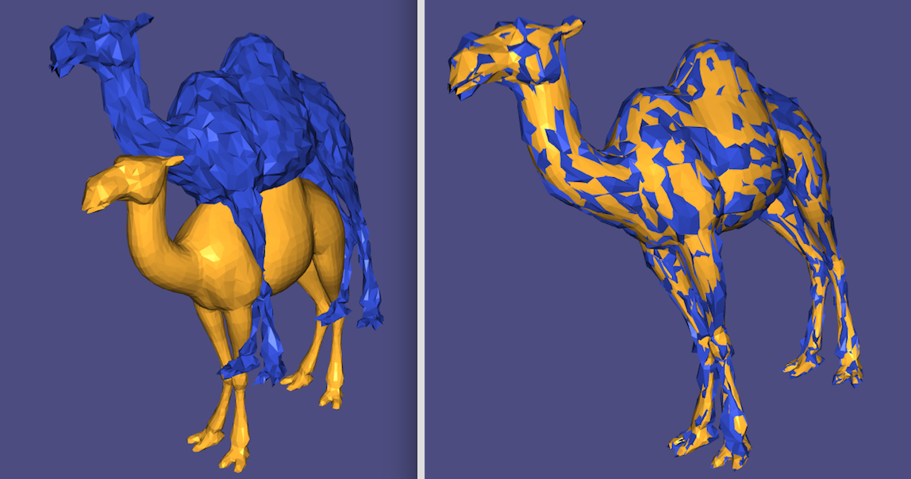

# ICP---Iterated Closest Point---Project

A C++ program for the alignment of two input meshes. 

The class __ICP_Solver__ contains all the functionality for initializing and 
executing a variant of the basic [ICP algorithm](http://graphics.stanford.edu/courses/cs164-09-spring/Handouts/paper_icp.pdf).

We use [nanoflann](https://github.com/jlblancoc/nanoflann) for kd-tree implementation, [Eigen](http://eigen.tuxfamily.org/i) for matrices, 
and [libigl](https://github.com/libigl/libigl) for the main OpenGL interface. 

Example: 

```C++

ICP_Solver solver = ICP_Solver(data_verts, model_verts);
solver.perform_icp();
aligned_mesh = solver.data_verts;

```

